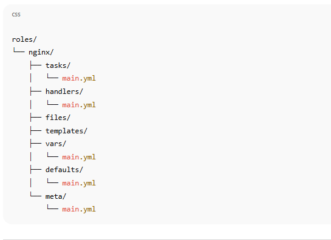

“Ansible roles are basically a way to organize playbooks into smaller, reusable parts.
Instead of keeping all the tasks in one long playbook, roles help divide them based on functionality.

For example, if I’m setting up a web server, I can create an nginx role that contains all the tasks, handlers, templates, and variables related to nginx.

Roles follow a standard folder structure — we usually have folders like tasks, handlers, files, templates, vars, and defaults.

Each folder has a specific purpose — for example, tasks contain the main automation steps, handlers handle service restarts, templates store configuration templates, and vars hold variable data.

The main advantage is that roles make playbooks cleaner, easier to maintain, and reusable across different projects or environments.

Ansible Role Folder Structure (Standard Layout)
When you create a role (for example, nginx), Ansible expects this kind of structure:

Explanation of Each Folder (in simple English)
Folder	Purpose (Simple Meaning)

tasks/	Contains the main list of actions (like install, configure, start service).

handlers/	Used for restarting or reloading services (triggered by “notify”).

files/	Keeps normal files that you copy to the target system.

templates/	Stores .j2 Jinja2 template files (like nginx.conf.j2).

vars/	Contains variables specific to this role.

defaults/	Holds default variable values (lowest priority).

meta/	Defines role dependencies or metadata.

